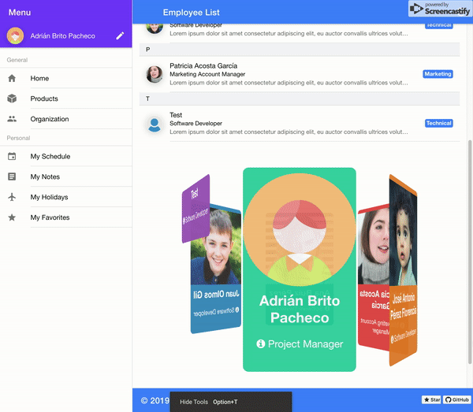
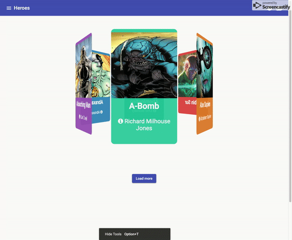

![Built With Stencil](https://img.shields.io/badge/-Built%20With%20Stencil-16161d.svg?logo=data%3Aimage%2Fsvg%2Bxml%3Bbase64%2CPD94bWwgdmVyc2lvbj0iMS4wIiBlbmNvZGluZz0idXRmLTgiPz4KPCEtLSBHZW5lcmF0b3I6IEFkb2JlIElsbHVzdHJhdG9yIDE5LjIuMSwgU1ZHIEV4cG9ydCBQbHVnLUluIC4gU1ZHIFZlcnNpb246IDYuMDAgQnVpbGQgMCkgIC0tPgo8c3ZnIHZlcnNpb249IjEuMSIgaWQ9IkxheWVyXzEiIHhtbG5zPSJodHRwOi8vd3d3LnczLm9yZy8yMDAwL3N2ZyIgeG1sbnM6eGxpbms9Imh0dHA6Ly93d3cudzMub3JnLzE5OTkveGxpbmsiIHg9IjBweCIgeT0iMHB4IgoJIHZpZXdCb3g9IjAgMCA1MTIgNTEyIiBzdHlsZT0iZW5hYmxlLWJhY2tncm91bmQ6bmV3IDAgMCA1MTIgNTEyOyIgeG1sOnNwYWNlPSJwcmVzZXJ2ZSI%2BCjxzdHlsZSB0eXBlPSJ0ZXh0L2NzcyI%2BCgkuc3Qwe2ZpbGw6I0ZGRkZGRjt9Cjwvc3R5bGU%2BCjxwYXRoIGNsYXNzPSJzdDAiIGQ9Ik00MjQuNywzNzMuOWMwLDM3LjYtNTUuMSw2OC42LTkyLjcsNjguNkgxODAuNGMtMzcuOSwwLTkyLjctMzAuNy05Mi43LTY4LjZ2LTMuNmgzMzYuOVYzNzMuOXoiLz4KPHBhdGggY2xhc3M9InN0MCIgZD0iTTQyNC43LDI5Mi4xSDE4MC40Yy0zNy42LDAtOTIuNy0zMS05Mi43LTY4LjZ2LTMuNkgzMzJjMzcuNiwwLDkyLjcsMzEsOTIuNyw2OC42VjI5Mi4xeiIvPgo8cGF0aCBjbGFzcz0ic3QwIiBkPSJNNDI0LjcsMTQxLjdIODcuN3YtMy42YzAtMzcuNiw1NC44LTY4LjYsOTIuNy02OC42SDMzMmMzNy45LDAsOTIuNywzMC43LDkyLjcsNjguNlYxNDEuN3oiLz4KPC9zdmc%2BCg%3D%3D&colorA=16161d&style=flat-square)

# Stencil 3D Card Carousel

[](https://github.com/abritopach) [](https://www.npmjs.com/package/st-three-dimensional-card-carousel) [](https://www.npmjs.com/package/st-three-dimensional-card-carousel)

Sample project that shows an experimental 3D card carousel Web Component built with Stencil.

Stencil is also great for building entire apps. For that, use the [stencil-app-starter](https://github.com/ionic-team/stencil-app-starter) instead.

<a href="https://www.buymeacoffee.com/h6WVj4HcD" target="_blank"></a>

# Stencil

Stencil is a compiler for building fast web apps using Web Components.

Stencil combines the best concepts of the most popular frontend frameworks into a compile-time rather than run-time tool.  Stencil takes TypeScript, JSX, a tiny virtual DOM layer, efficient one-way data binding, an asynchronous rendering pipeline (similar to React Fiber), and lazy-loading out of the box, and generates 100% standards-based Web Components that run in any browser supporting the Custom Elements v1 spec.

Stencil components are just Web Components, so they work in any major framework or with no framework at all.

## Component preview


## Component properties

| Property       | Attribute        | Description | Type                                                        | Default                                                               |
| -------------- | ---------------- | ----------- | ----------------------------------------------------------- | --------------------------------------------------------------------- |
| `animationSelectedSlide` | `animation-selected-slide` |             | `boolean`                               | `true`
| `autoloop`     | --               |             | `{ enabled: boolean; seconds: number; direction: string; }` | `{     enabled: false,     seconds: 2000,     direction: 'right'   }` |
| `distance`     | `distance`       |             | `number`                                                    | `undefined`
| `initialSlide` | `initial-slide`  |             | `number`                                                    | `1`                                                                   |
| `keyboard`     | `keyboard`       |             | `boolean`                                                   | `false`
| `slideStyle`   | --               |             | `{}`                                                        | `{   }`
| `slides`       | --               |             | `CardItem[]`                                                | `[]`                                                                  |
| `slidesToShow` | `slides-to-show` |             | `number`                                                    | `6`

## Component events

| Event          | Description | Type               |
| -------------- | ----------- | ------------------ |
| `currentItem`  |             | `CustomEvent<any>` |
| `selectedItem` |             | `CustomEvent<any>` |
| `slideChange`  |             | `CustomEvent<any>` |

## Component public API methods

### `cycle() => Promise<boolean>`


#### Returns

Type: `Promise<boolean>`


### `next() => Promise<CardItem>`


#### Returns

Type: `Promise<CardItem>`


### `prev() => Promise<CardItem>`


#### Returns

Type: `Promise<CardItem>`


### `select(slideId: number) => Promise<CardItem>`


#### Returns

Type: `Promise<CardItem>`


## Getting Started

Before you go through this component, you should have at least a basic understanding of Stencil concepts.

```bash
git clone https://github.com/abritopach/st-3d-card-carousel
cd st-3d-card-carousel
```

and run:

```bash
npm install
npm start
```

To build the component for production, run:

```bash
npm run build
```

To run the unit tests for the components, run:

```bash
npm test
```

## Naming Components

When creating new component tags, we recommend _not_ using `stencil` in the component name (ex: `<stencil-datepicker>`). This is because the generated component has little to nothing to do with Stencil; it's just a web component!

Instead, use a prefix that fits your company or any name for a group of related components. For example, all of the Ionic generated web components use the prefix `ion`.


## Using this component


### Ionic / Angular project

1) Install the package.

```bash
npm install st-three-dimensional-card-carousel --save
```

2) Modify main.ts to import and make a call to defineCustomElements.

```bash
import { enableProdMode } from '@angular/core'
import { platformBrowserDynamic } from '@angular/platform-browser-dynamic'

import { AppModule } from './app/app.module'
import { environment } from './environments/environment'

import { defineCustomElements } from 'st-three-dimensional-card-carousel/dist/loader'

if (environment.production) {
  enableProdMode()
}

platformBrowserDynamic()
  .bootstrapModule(AppModule)
  .catch(err => console.log(err))
defineCustomElements(window)
```

3) Add the CUSTOM_ELEMENTS_SCHEMA.

```bash
import { NgModule, CUSTOM_ELEMENTS_SCHEMA } from '@angular/core'
import { CommonModule } from '@angular/common'
import { IonicModule } from '@ionic/angular'
import { FormsModule } from '@angular/forms'
import { RouterModule } from '@angular/router'

import { HomePage } from './home.page'

@NgModule({
  imports: [
    CommonModule,
    FormsModule,
    IonicModule,
    RouterModule.forChild([
      {
        path: '',
        component: HomePage,
      },
    ]),
  ],
  schemas: [CUSTOM_ELEMENTS_SCHEMA],
  declarations: [HomePage],
})
export class HomePageModule {}
```

### Vue project

1) Install the package.

```bash
npm install st-three-dimensional-card-carousel --save
```

2) Modify main.js to import and make a call to defineCustomElements.


```bash
import Vue from 'vue'
import App from './App.vue'

import { defineCustomElements, applyPolyfills } from 'st-three-dimensional-card-carousel/loader';

Vue.config.productionTip = false

// tell Vue to ignore all components defined in the st-three-dimensional-card-carousel/loader
// package. The regex assumes all components names are prefixed.
// 'st'
Vue.config.ignoredElements = [/st-\w*/];

// Bind the custom elements to the window object.
applyPolyfills().then(() => {
  defineCustomElements(window);
});

new Vue({
  render: h => h(App),
}).$mount('#app')
```

### Example Ionic project

- Component in Ionic project: https://github.com/abritopach/ionic-employees-stitch-mongodb



### Example Angular project

- Component in Angular project: https://github.com/abritopach/angular-architecture



### Example React project

### Example Vue project

- Component in Vue project: https://github.com/abritopach/vue-stencil-3d-card-carousel


### Script tag

- [NPM](https://www.npmjs.com/package/st-three-dimensional-card-carousel)
- Put a script tag similar to this `<script src='https://unpkg.com/st-three-dimensional-card-carousel@0.0.1/dist/st-three-dimensional-card-carousel.js'></script>` in the head of your index.html
- Then you can use the element anywhere in your template, JSX, html etc

### Node Modules
- Run `npm install st-three-dimensional-card-carousel --save`
- Put a script tag similar to this `<script src='node_modules/my-component/dist/st-three-dimensional-card-carousel.js'></script>` in the head of your index.html
- Then you can use the element anywhere in your template, JSX, html etc

### In a stencil-starter app
- Run `npm install st-three-dimensional-card-carousel --save`
- Add an import to the npm packages `import st-three-dimensional-card-carousel;`
- Then you can use the element anywhere in your template, JSX, html etc
