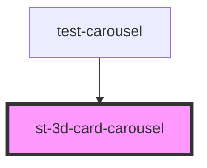

# st-3d-card-carousel

<!-- Auto Generated Below -->

## Properties

| Property                 | Attribute                  | Description | Type                                                        | Default                                                                     |
| ------------------------ | -------------------------- | ----------- | ----------------------------------------------------------- | --------------------------------------------------------------------------- |
| `allowSwipeSlide`        | --                         |             | `{ prev: boolean; next: boolean; }`                         | `{     prev: true,     next: true   }`                                      |
| `animationSelectedSlide` | `animation-selected-slide` |             | `boolean`                                                   | `true`                                                                      |
| `autoloop`               | --                         |             | `{ enabled: boolean; seconds: number; direction: string; }` | `{     enabled: false,     seconds: 2000,     direction: 'right'   }`       |
| `axis`                   | `axis`                     |             | `string`                                                    | `'horizontal'`                                                              |
| `controls`               | --                         |             | `{ enabled: boolean; position: string; text: string[]; }`   | `{     enabled: false,     position: 'top',     text: ['prev', 'next']   }` |
| `distance`               | `distance`                 |             | `number`                                                    | `undefined`                                                                 |
| `initialSlide`           | `initial-slide`            |             | `number`                                                    | `1`                                                                         |
| `keyboard`               | `keyboard`                 |             | `boolean`                                                   | `false`                                                                     |
| `slideStyle`             | --                         |             | `{}`                                                        | `{   }`                                                                     |
| `slides`                 | --                         |             | `CardItem[]`                                                | `[]`                                                                        |
| `slidesToShow`           | `slides-to-show`           |             | `number`                                                    | `6`                                                                         |

## Events

| Event            | Description | Type               |
| ---------------- | ----------- | ------------------ |
| `currentItem`    |             | `CustomEvent<any>` |
| `selectedItem`   |             | `CustomEvent<any>` |
| `slideChange`    |             | `CustomEvent<any>` |
| `slideDoubleTap` |             | `CustomEvent<any>` |

## Methods

### `cycle() => Promise<boolean>`

#### Returns

Type: `Promise<boolean>`

### `getActiveIndex() => Promise<number>`

#### Returns

Type: `Promise<number>`

### `getNextIndex() => Promise<number>`

#### Returns

Type: `Promise<number>`

### `getPreviousIndex() => Promise<number>`

#### Returns

Type: `Promise<number>`

### `isBeginning() => Promise<boolean>`

#### Returns

Type: `Promise<boolean>`

### `isEnd() => Promise<boolean>`

#### Returns

Type: `Promise<boolean>`

### `length() => Promise<number>`

#### Returns

Type: `Promise<number>`

### `next() => Promise<CardItem>`

#### Returns

Type: `Promise<CardItem>`

### `prev() => Promise<CardItem>`

#### Returns

Type: `Promise<CardItem>`

### `select(slideId: string | number) => Promise<CardItem>`

#### Returns

Type: `Promise<CardItem>`

### `slideReset() => Promise<CardItem>`

#### Returns

Type: `Promise<CardItem>`

## Dependencies

### Used by

 - [test-carousel](../test-carousel)

### Graph

----------------------------------------------

*Built with [StencilJS](https://stenciljs.com/)*
