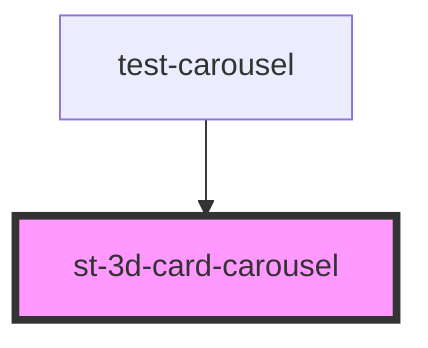

# st-3d-card-carousel

<!-- Auto Generated Below -->

## Properties

| Property   | Attribute | Description | Type                                     | Default                                       |
| ---------- | --------- | ----------- | ---------------------------------------- | --------------------------------------------- |
| `autoloop` | --        |             | `{ enabled: boolean; seconds: number; }` | `{     enabled: false,     seconds: 2000   }` |
| `slides`   | --        |             | `CardItem[]`                             | `[]`                                          |

## Events

| Event          | Description | Type               |
| -------------- | ----------- | ------------------ |
| `selectedItem` |             | `CustomEvent<any>` |

## Dependencies

### Used by

 - [test-carousel](../test-carousel)

### Graph

----------------------------------------------

*Built with [StencilJS](https://stenciljs.com/)*
