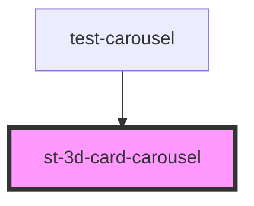

# st-3d-card-carousel

<!-- Auto Generated Below -->

## Properties

| Property       | Attribute        | Description | Type                                     | Default                                       |
| -------------- | ---------------- | ----------- | ---------------------------------------- | --------------------------------------------- |
| `autoloop`     | --               |             | `{ enabled: boolean; seconds: number; }` | `{     enabled: false,     seconds: 2000   }` |
| `initialSlide` | `initial-slide`  |             | `number`                                 | `1`                                           |
| `keyboard`     | `keyboard`       |             | `boolean`                                | `false`                                       |
| `slides`       | --               |             | `CardItem[]`                             | `[]`                                          |
| `slidesToShow` | `slides-to-show` |             | `number`                                 | `6`                                           |

## Events

| Event          | Description | Type               |
| -------------- | ----------- | ------------------ |
| `currentItem`  |             | `CustomEvent<any>` |
| `selectedItem` |             | `CustomEvent<any>` |

## Methods

### `cycle() => Promise<boolean>`

#### Returns

Type: `Promise<boolean>`

### `next() => Promise<CardItem>`

#### Returns

Type: `Promise<CardItem>`

### `prev() => Promise<CardItem>`

#### Returns

Type: `Promise<CardItem>`

### `select(slideId: number) => Promise<CardItem>`

#### Returns

Type: `Promise<CardItem>`

## Dependencies

### Used by

 - [test-carousel](../test-carousel)

### Graph

----------------------------------------------

*Built with [StencilJS](https://stenciljs.com/)*
